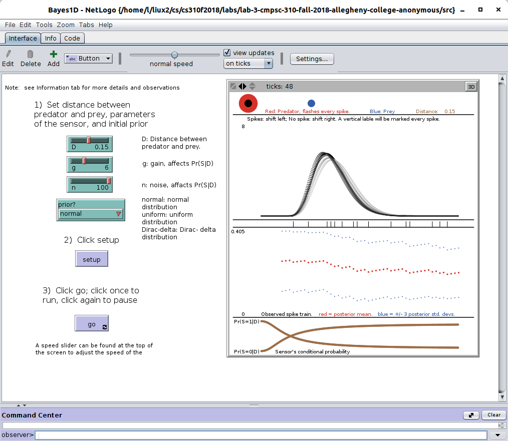

## Reflection by Xingbang Liu and Bailong Li

## Lab 3

## Interface Look

## Added Functions

1. **Button notes**

In the button area, we added notes for clients to understand the meaning and functions of every buttons. D means the distance between predator and prey. G means gain that can affect pr(s|o) and G means noise. we also added the meaning of normal, uniform and Dirac-delta.

2. **Plots notes**

In the plot area, we added titles and notes to indicate the function of every graphs. The distance between predator and prey will be shown in the notes. We also resized and recolored the sensor's conditional probability curve to make it more noticeable.

3. **summary**

when we open this NetLogo program, our team main goals is that we need improve the clients' usage experience. The interface was too simple to understand for the clients who use this code at first time. Therefore, we added button notes and plots notes in order to explain how to work with this code and what is the meaning of output graphs.
