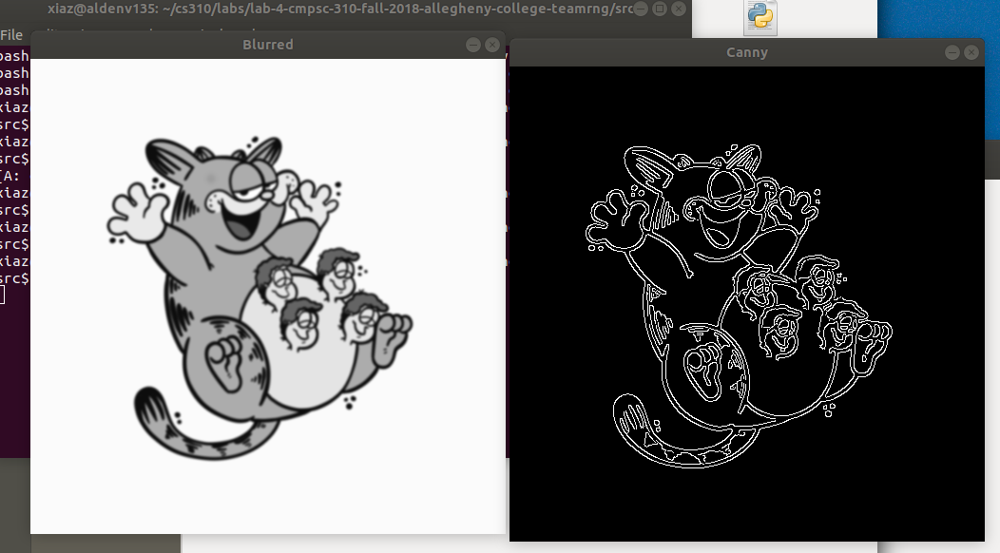

# Reflection by Team RNG

## The program colorspaces.py changes a given image from it's a original RGB color palette to Grayscale, HSV and L*a*b respectively. The process of grayscale conversion is fairly straightforward. What we had issues with is the HSV and L*a*b. In order to better understand the process, we had to add a bunch of test images consist of squares representing individual pixels.

## Regarding the blurring program and the blurring methods. They were relatively easy to understand. One element that the blurring methods shared is the "kernels" to determine the blur section. The difference was how the way each method treated the neighboring pixels of the center pixel of the kernel which lead to different results. Averaging and Gaussian are fairly similar to each other, the median method blurs away the details but still retains the "edge" of the image. For the bilatteral method, we didn't get to observe the difference very much since the blur was incredibly unnoticeable, hence why the book refers to it as the best method.

## For the Thresholding, it basically is the method that can make the image become white can black colors. Since the thresholding can make the image just be two colors, the edge and the contour would be more clear, and the borderline of the image can be easily be found. Since we used the `coin.png` file in this program, we can easily find the edges of this image since these coins are kinds of dark color and the background is a kinds of light color. However, when we used the `beach.png` be run in this program, the result was not good as the previous one. We not familiar with that what exact quality of the image can use this method. We thought we can use this methond in like photoshop to crop like people out from the image.

## For the edge detection, it is a way that detect the edge of images and draw that with white line on the black. It is easier for us to use is on the image which have striking contrast colors and simple patterns. It will be hard to detect every edges for a complex images especially with similar colors.

## We used the canny.py program for the edge detection of our custom image. While the output of the program was fairly accurate, there are a few issues that we noticed. The first issue was the inner details of the image. First of all, the program detected those parts even though they aren't technically the "edge" of the image. Another one was that some of them was inaccurately traced.

## The Screenshot:

